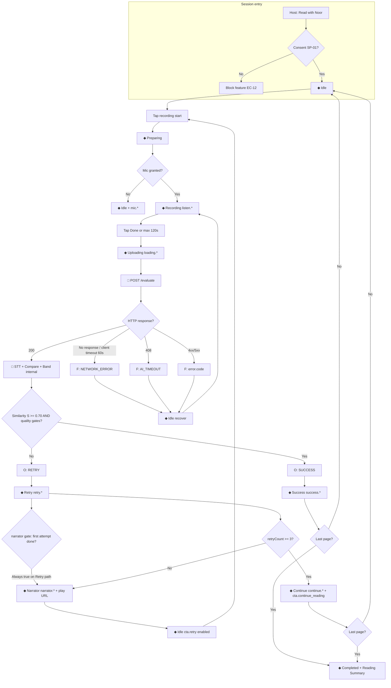

# AI Decision Tree

**Version:** 1.0  
**Status:** Final — implementation reference for client + backend orchestration  
**Audience:** Engineering, QA, Product  
**Aligns with:** `12_AI_Evaluation_Flow.md`, `13_System_Flow.md`, `15_Technical_Architecture.md`, `Reading Evaluation Rules.md`, `Business Rules.md`, `Error Handling.md`

---

## Purpose

Single decision reference for **Read with Noor**: from **recording start** through **completion**, including **fallback branches** for failures. Child-visible results collapse to **Success**, **Retry**, **Continue**, or **recoverable fault** (return to **Idle**).

**Canonical terms:** **recording start** = `cta.start_reading`; **recording stop** = `cta.done_reading` (**Done**).

---

## Legend

| Symbol | Meaning |
|--------|---------|
| ◆ | Client state (`12`) |
| □ | Backend step |
| → | Happy path |
| ⇢ | Fallback / alternate branch |
| **O** | Outcome (HTTP 200) |
| **F** | Failure (`failureCode`) |

---

## Master flow (Mermaid)



---

## Structured decision tree (text)

### Phase 0 — Entry and gates

1. **Read with Noor** tapped → emit `reading_session_started`.  
2. **Consent gate (SP-01):** if not granted → stop; no mic; no API (**BR-CNS-01**, EC-12).  
3. Enter **Idle** on current page.

### Phase 1 — Prepare and record

4. **recording start** → **Preparing** → request mic.  
   - **Denied** ⇢ **Idle**, show `mic.01` / `mic.02`; no upload.  
5. **Granted** → **Recording**; optional `before.*`, `listen.*`.  
6. **recording stop** when child taps **Done** (min 1s) OR auto at 120s.  
   - Emit `page_recording_stopped`; increment `attemptSequence`.

### Phase 2 — Upload

7. **Uploading**; show `loading.*`; emit `page_upload_started`.  
8. **POST /evaluate** with audio + metadata + `Idempotency-Key`.  
   - Client retry policy: max 2 retries on `NETWORK_ERROR`, `502`, `503` with 1s/2s backoff (`15`).  
   - **No** auto-retry on most 4xx.

### Phase 3 — Backend orchestration

9. **Validate** MIME, size, duration.  
   - Fail ⇢ **F** (`INVALID_AUDIO`, `UNSUPPORTED_FORMAT`, `PAYLOAD_TOO_LARGE`).  
10. **STT (Arabic)** → transcript + confidence.  
    - No speech ⇢ **F** `EMPTY_AUDIO`.  
    - Provider fail ⇢ **F** `STT_FAILED`.  
    - Confidence below reject threshold ⇢ **F** `LOW_CONFIDENCE` (policy in `Reading Evaluation Rules.md`).  
11. **Compare** to page reference text → similarity **S**.  
12. **Assign internal band** (Excellent … Needs Full Assistance) — **internal only**.  
13. **Outcome decision:**  
    - **S ≥ 0.70** (and gates pass) → **O: SUCCESS**.  
    - Else → **O: RETRY**.  
14. **Decision Engine:** on **RETRY**, increment `retryCount` for page; if `retryCount >= 3` → `offerContinue: true`.  
15. If wall clock > **30s** server ⇢ **F** `AI_TIMEOUT`.

### Phase 4 — Client outcome handling

16. **SUCCESS** → **Success** UI; `success.*`; primary `cta.next_page`.  
    - Analytics: `page_outcome_success`.  
    - **Next page** → **Idle** on next index.  
    - **Last page** → **Completed** + summary + `reading_session_completed`.

17. **RETRY** → **Retry** UI; `retry.*`; analytics `page_outcome_retry`.  
    - **Narrator gate:** play narrator **only** on this path (never before first evaluation on page — satisfied because **Retry** requires prior **Done**).  
    - Show `narrator.01` / `narrator.02`; enter **Narrator**; emit `narrator_started`.  
    - On complete → **Idle** with `cta.retry`.  
    - If `offerContinue` → also present **Continue** state (`continue.*`, `cta.continue_reading`); analytics `page_continue_offered`.  
    - **Continue** tapped → mark `continuedWithoutSuccessPageIds`; advance page; `page_continue_accepted`.

### Phase 5 — Failure fallback branches

Failures **do not** set **Success** or **Retry** outcome. Return **Idle** (or stay recoverable) and map `failureCode` per `Error Handling.md`.

| Branch | Trigger | Client next step |
|--------|---------|------------------|
| **Network** | No HTTP, socket error, client 60s timeout | `network.01`; when online, **Done** again |
| **AI timeout** | HTTP 408 / server 30s | `network.02`; manual **Done** (no auto re-upload) |
| **Empty / invalid audio** | `EMPTY_AUDIO`, `INVALID_AUDIO` | `retry.01`; re-record |
| **Low STT confidence** | `LOW_CONFIDENCE` | `retry.02`; re-record |
| **Upstream** | `STT_FAILED`, `EVALUATION_FAILED`, `UPSTREAM_ERROR`, `SERVICE_UNAVAILABLE` | `network.02`; retry **Done** later |
| **Payload** | `PAYLOAD_TOO_LARGE` | `retry.01`; shorter recording |

All failures: analytics `page_failure` with `{ failureCode, recoverable, pageId, pageIndex, storyId }`.

---

## Narrator gate (explicit rule)

```
IF page has zero prior HTTP-200 outcomes this session THEN
  narrator MUST NOT play
END IF

IF latest HTTP-200 outcome == RETRY THEN
  narrator MAY play (Decision 6)
END IF

IF latest HTTP-200 outcome == SUCCESS THEN
  narrator MUST NOT play
END IF
```

First page visit always goes through **Recording** before any narrator audio (**BR-RWF-01**).

---

## Retry cap and Continue (Decision 7)

```
ON HTTP-200 RETRY:
  retryCount = retryCount + 1
  IF retryCount >= MAX_RETRY_OUTCOMES_PER_PAGE (3) THEN
    offerContinue = true
    UI state = Continue (in addition to narrator path already taken for this response)
  END IF
END ON
```

**Important sequencing for UX:** On the 3rd **RETRY**, child still experiences encouragement + narrator, then sees **Continue** offer (per `11` Decision 7 section and AC-06-02). Engineering may show **Continue** after narrator completes to avoid competing CTAs.

**Failures** do not increment `retryCount` (**BR-RET-05**).

---

## Idempotency and duplicate taps

```
IF upload already in flight THEN
  ignore second Done (debounce EC-07)
END IF

Idempotency-Key = clientSessionId:pageId:attemptSequence
```

Duplicate **Retry** taps during **Narrator**: ignore or pause/resume per audio player policy; do not double POST.

---

## App backgrounding / leave page (EC-06)

```
IF state IN (Uploading, Evaluating) AND app backgrounded OR route popped THEN
  cancel in-flight HTTP if safe
  persist Session Store
  return to Idle on return OR host-defined story exit
  do NOT auto-resubmit audio
END IF
```

Child must tap **Done** again to resubmit after return.

---

## Completion conditions

| Condition | Result |
|-----------|--------|
| Last page + **SUCCESS** | **Completed** |
| Last page + Decision 7 **Continue** accepted | **Completed** |
| Mid-story **Continue** | Next page **Idle** |
| Session exit from host | Persist store; no forced **Completed** |

---

## Fallback: provider degradation (SP-04)

If STT/eval vendor unavailable after retries:

1. Return **503** `SERVICE_UNAVAILABLE` or **502** `UPSTREAM_ERROR`.  
2. Child sees `network.02`; remains on page.  
3. **Never** expose vendor name or stack trace.  
4. Ops alert via monitoring (`15` § NFR).

**No silent pass:** do not default to **SUCCESS** without evaluation.

---

## Fallback: client-side evaluate budget exceeded

If session evaluate count approaches **40** (`BR-PLT-05`):

- Block new uploads with recoverable message (coordinate copy with product; interim: reuse `network.02` + host toast if needed).  
- Allow passive reading exit.

---

## Decision table summary

| Input condition | Internal band (examples) | API outcome | UI state | Narrator | Continue offer |
|-----------------|---------------------------|-------------|----------|----------|----------------|
| S ≥ 0.90 | Excellent / Good / Minor | SUCCESS | Success | No | No |
| 0.70 ≤ S < 0.90 | Minor / Good | SUCCESS | Success | No | No |
| S < 0.70 | Major / Needs Assistance | RETRY | Retry | Yes | If count ≥ 3 |
| STT fail | — | error | Idle | No | No |
| Timeout | — | AI_TIMEOUT | Idle | No | No |

---

## Verification hooks

| Decision point | Analytics / log |
|----------------|-----------------|
| Record start | `page_recording_started` |
| Upload | `page_upload_started`, `page_upload_completed` |
| SUCCESS | `page_outcome_success` + internal band in server log |
| RETRY | `page_outcome_retry` |
| Continue | `page_continue_offered`, `page_continue_accepted` |
| Failure | `page_failure` |
| Done | `reading_session_completed` |

---

## Change log

| Version | Date | Notes |
|---------|------|-------|
| 1.0 | 2026-07-27 | Master tree aligned with `12`/`13`/`15` |
