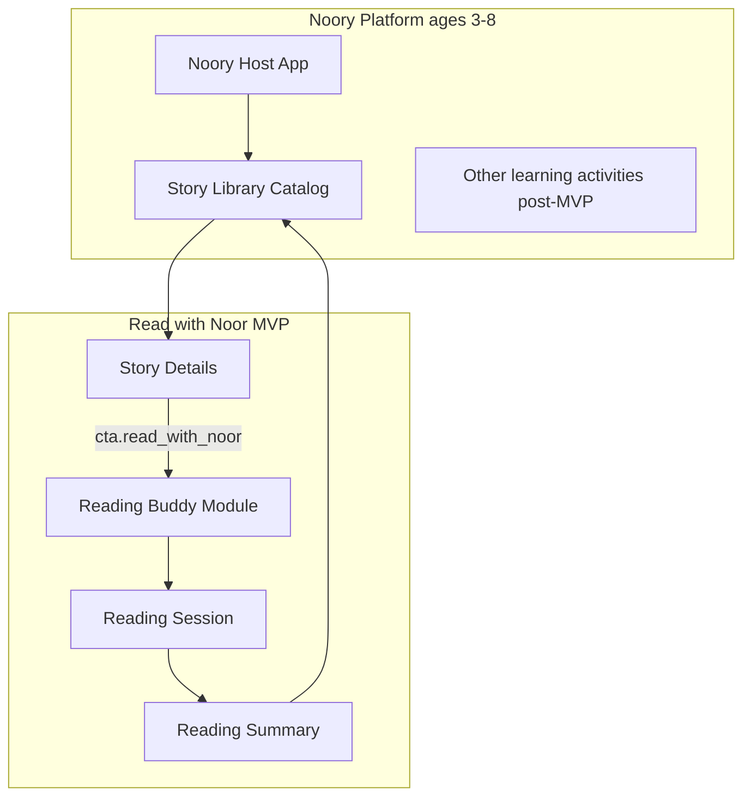
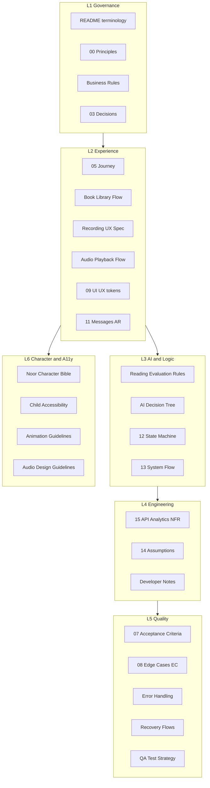
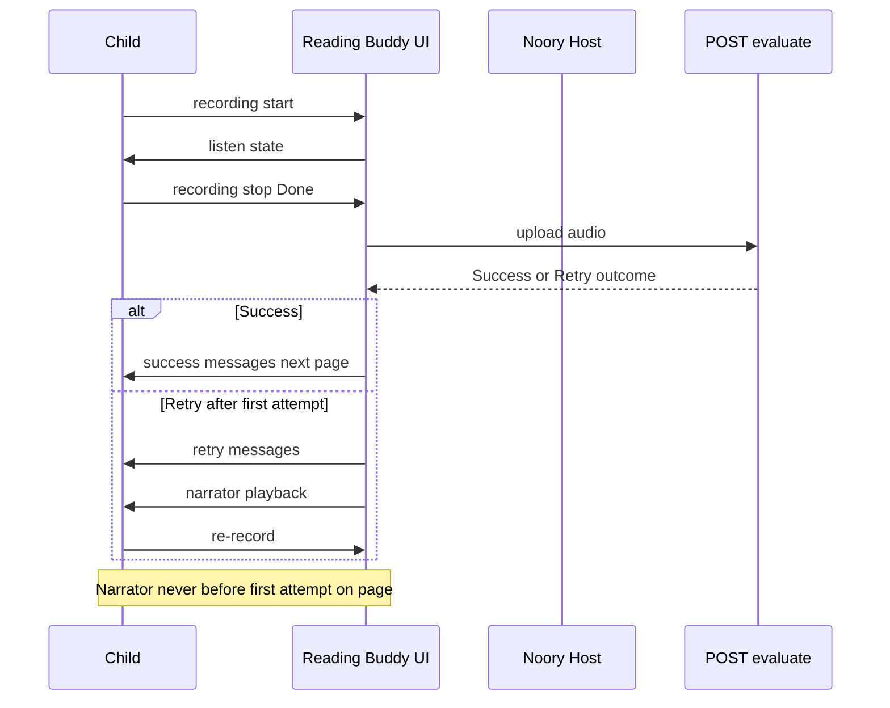

# Architecture Overview — Noory Documentation

**Version:** 1.0  
**Status:** Final  
**Audience:** Product Review Board, Engineering, QA, Cursor AI  

This document explains **how specification files relate**. It does not duplicate normative rules—see **`FINAL_DOCUMENTATION_INDEX.md`** for owners.

---

## Product context

**Canonical user flow (Read with Noor):**

Noory host → **Story / Library Catalog** → **Story Details** → **Read with Noor** (consent/mic) → **Reading Session** (per-page: **recording start** → read → **recording stop** → upload → evaluation → feedback) → next page or **Reading Summary** → Catalog.

Same flow in: `05_User_Journey.md`, `Book Library Flow.md`, `13_System_Flow.md`, `QA Test Strategy.md` (F1–F3).

---

## Documentation layers

**Dependency rule:** Lower layers must not contradict L1. **`00_Project_Principles.md`** wins conflicts, then **`03_Product_Decisions.md`** / **`19_Decision_Log.md`**, then topic owners in the index.

---

## Read with Noor — runtime architecture (logical)

Normative detail: **`AI Decision Tree.md`**, **`12_AI_Evaluation_Flow.md`**, **`Recording UX Specification.md`**.

---

## Single source of truth matrix

| Concern | Do not duplicate in | Owner |
|---------|---------------------|--------|
| BR-* rules | `01`, `07`, `12` prose | `Business Rules.md` |
| EC-01–EC-13 definitions | `Error Handling.md` titles only; link EC ID | `08_Edge_Cases.md` |
| failureCode tables | `08` | `Error Handling.md` |
| Internal bands Excellent… | Child UI | `Reading Evaluation Rules.md` |
| Wire states Idle/Recording/… | UX spec duplicates OK if aligned | `12` (wire), `Recording UX Specification.md` (UX labels) |
| Arabic strings | Code, Figma, DOCX | `11_Message_Library.md` |
| API JSON schema | `12` | `15` § API Contracts |
| Analytics event names | `12` | `15` § Analytics |
| Noor tone / forbidden words | Long form in `10` | `Noor Character Bible.md` |
| Phase roadmap | `18` ideas list | `Future Roadmap.md` (phases), `18` (ideas) |

---

## Implementation package map (Flutter)

| Spec | Code alignment |
|------|------------------|
| `Book Library Flow.md` | Host catalog + `StoryLibraryScreen` |
| `11_Message_Library.md` | `assets/messages_ar.json` **must match keys** (no extra score copy) |
| `12` / `13` | `ReadingBuddyState`, Session Store |
| `15` | Backend `/evaluate`, analytics |
| `16` | Milestones, module boundaries |

See **`Developer Notes.md`** for sync rules.

---

## Related files

- **`FINAL_DOCUMENTATION_INDEX.md`** — full file registry  
- **`00_Index.md`** — navigation entry  
- **`REVIEW_REPORT.md`** — latest consolidation audit  
- **`README.md`** — terminology and reading order  
