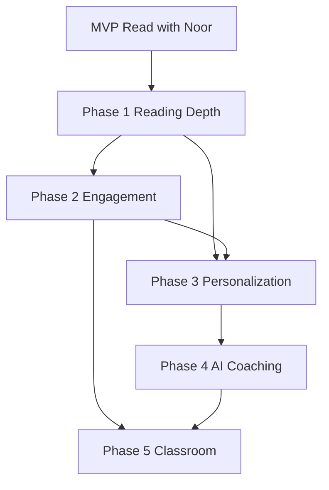

# Future Roadmap

**Version:** 1.0  
**Status:** Final — platform vision (post-MVP)  
**Audience:** Leadership, PM, Engineering  
**Relationship to `18_Future_Ideas.md`:** `18` captures feature ideas and phased reading-buddy expansion. **This document extends the lens to the full Noory platform** (ages 3–8, Arabic-first) without replacing or duplicating every item in `18`. When both mention the same capability, **`18` remains the reading-feature backlog**; this file adds **platform sequencing, dependencies, and cross-product integration**.

---

# Purpose

Describe how **Noory** evolves after **Read with Noor** MVP proves value: platform capabilities, reading adjacencies, and enabling infrastructure. **MVP scope stays locked** per `README.md` and `03_Product_Decisions.md` until explicit phase gates pass.

---

# North Star (Platform)

**Noory** helps Arabic-speaking children (3–8) learn through joyful, safe, companion-led experiences — with **Noor** as a consistent emotional anchor across activities, not only reading aloud.

MVP validates one activity: **AI Reading Buddy** (**Reading Session** → **Reading Summary**). Later phases add activities, parent value, and depth — without turning the platform into exam-centric or punitive gamification (`Gamification Rules.md`, D-09).

---

# Phase Gates (All Phases)

Advance only when `18_Future_Ideas.md` § Success Criteria for Expansion are met:

- Strong **Reading Session** / story completion rates
- Positive child usability (3–8)
- Stable evaluate pipeline (latency, failure rates per `15` NFR)
- Parent trust (consent, privacy SP-01–SP-05)

---

# Phase 0 — MVP (Current) ✅

**Scope:** Documented in `01_Product_Brief.md`, `README.md`.

- **Read with Noor** in host app
- Page record → evaluate → **Success** / **Retry** / Decision 7 **Continue**
- Narrator assist on **Retry**
- **Reading Summary** (effort + pages, no child score)
- Arabic RTL, `11` message library
- Analytics canonical in `15`

**Platform deliverables:** Flutter Reading Buddy module, `/evaluate` API, Session Store, consent integration.

**Out of scope:** See `README.md` MVP Out and `Gamification Rules.md`.

---

# Phase 1 — Reading Depth on Platform

**Goal:** Deepen reading without new activity types.

| Capability | User value | Dependencies |
|------------|------------|--------------|
| **Reading history UI** | Child continues unfinished stories; sees completed books (`18` Phase 2) | Host content index; session persistence upgrade (optional server sync — **Assumption** in `14`) |
| **Parent reading insights (light)** | Frequency, books finished — not live proctoring | Analytics warehouse; SP-compliant aggregates |
| **Improved failure recovery** | Offline queue, retry upload (`18` Technical) | Client sync design; conflict with SP-02 retention |
| **Streaming STT** (optional) | Faster feedback | Vendor + `15` API revision |

**Noory platform work:** unified “My Reading” surface; link from story catalog to in-progress **Reading Session** state.

**Still not in Phase 1:** Leaderboards, badges, word-level coaching (`18` Phase 4).

---

# Phase 2 — Engagement & Motivation (Controlled)

**Goal:** Celebrate progress across the platform with **opt-in, non-punitive** mechanics.

| Capability | Notes | Dependency on MVP |
|------------|-------|-------------------|
| **Achievements** (`18`) | First story, explorer badges — effort-based, not accuracy | `reading_session_completed` events; product rules stricter than `Gamification Rules.md` MVP |
| **Parent dashboard** (`18`) | Milestones, encouragement tips | Phase 1 analytics; legal copy |
| **Contextual personalization** | Recommendations, name-led delight expansion | Child profile APIs; `11` extensions |
| **Seasonal Noor messages** | `11` Future Enhancements | CMS or remote config |

**Platform principle:** Any gamification must pass **child-safe review** (no streak punishment, no public ranks) — extend `Gamification Rules.md` in a future version before build.

**Dependencies:** Identity/profile already in Noory; no duplicate auth (same constraint as MVP).

---

# Phase 3 — Personalization & Adaptive Learning

**Goal:** Right story, right support — still companion-led, not exam-led.

From `18` Phase 3:

- Adaptive reading difficulty
- Favorite story recommendations
- Personalized learning journey

**Platform dependencies:**

- Content tagging (level, phonics, theme)
- Recommendation service
- Privacy review for profiling (SP-03, regional regulations)
- Optional: separate **Noor** message variants by age band (`11` future: age-based messages)

**Reading Buddy interaction:** Evaluation signals (internal only) may inform recommendations — **never** child-facing scores.

---

# Phase 4 — AI Coaching & Literacy Tools

**Goal:** Deeper literacy support beyond page-level **Success** / **Retry**.

From `18` Phase 4:

- Word-level pronunciation feedback
- Fluency analysis, pace insights
- Difficult word detection

**Dependencies:**

- New API surfaces (word alignment, phoneme feedback)
- UX research with 5–8 band (motor + shame sensitivity)
- Expanded `11` for micro-feedback (still no “wrong” lexicon)
- Teacher/parent reporting policies

**Platform:** May appear as “Reading Tools” module plugged into same story shell as Reading Buddy.

---

# Phase 5 — Classroom & Ecosystem

From `18` Phase 5:

- Teacher portal, assignments, class overview
- Reading reports for schools

**Dependencies:**

- Org accounts, rostering, B2B legal
- Aggregated analytics only; child voice data minimization
- Separate from consumer Noory app or gated role

**Priority in `18`:** Lower until consumer validation complete.

---

# Phase 6 — Platform Expansion (Locales & Accessibility)

**Cross-cutting platform tracks** (parallel when resourced):

| Track | Items (`18`) | Notes |
|-------|--------------|-------|
| **Localization** | English, French, additional RTL | New `11`-style libraries per locale |
| **Accessibility platform modes** | Dyslexia-friendly font, high contrast, reduced motion, voice nav | Host-level settings affect Reading Buddy module |
| **Content types beyond books** | Poems, leveled passages, dialogues | New activity templates; Noor voice consistent |
| **Additional Noor activities** | Listening games, vocabulary — *not specified in MVP* | Each activity needs own spec package like reading |

---

# Platform Architecture Evolution

| MVP | Later |
|-----|--------|
| Client Session Store only | Optional cloud sync for history |
| Single `/evaluate` | Versioned APIs, coaching endpoints |
| Analytics via Noory SDK | Warehouse + parent/teacher views |
| Flutter module in host | Shared Noor SDK (character, messages, analytics) |

Technical enablers from `18` Technical Improvements: offline support, AI caching, faster evaluation, analytics platform — schedule per phase demand, not preemptively in MVP.

---

# Dependency Graph (Simplified)

Phase 6 (locales/a11y) can branch from MVP with host investment.

---

# What This Document Does Not Do

- **Does not replace `18_Future_Ideas.md`** — use `18` for feature brainstorming and reading-specific phase wording.
- **Does not change MVP scope** — engineering must not implement Phase 1+ without gate approval.
- **Does not duplicate API/analytics specs** — implementations still canonical in `15`.
- **Does not authorize gamification** — Phase 2 requires updated product rules beyond MVP `Gamification Rules.md`.

---

# Ownership and Updates

| Phase | DRI (typical) |
|-------|----------------|
| 0 MVP | PM + Eng lead |
| 1–2 | PM Platform + Reading feature owner |
| 3–4 | PM + ML/Eng + Child UX research |
| 5 | PM B2B + Legal |
| 6 | PM Platform + Localization |

Revise this roadmap when gate metrics from Phase 0 are published or when Noory corporate strategy adds non-reading activities.

---

# Decision Summary

- Noory platform grows in gated phases after reading MVP validation.
- `18_Future_Ideas.md` stays the reading-feature idea list; this file adds platform sequencing and dependencies.
- Child-safe, Arabic-first, and non-punitive motivation remain constraints across all phases.
