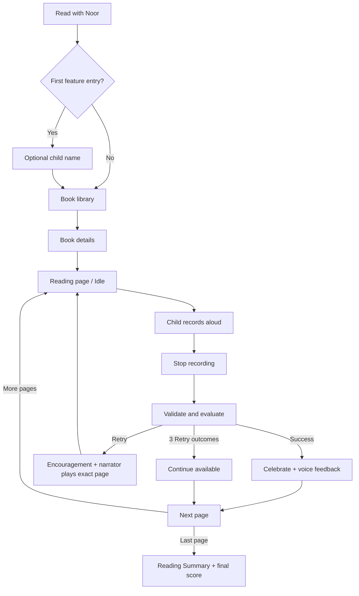

# Read with Noor — MVP Product Requirements Document

**Status:** Implementation-ready MVP specification  
**Product hierarchy:** **Noory — نوري** is the main application; **Read with Noor — اقرأ مع نور** is its interactive reading feature; **Noor — نور** is the reading companion character.
**Audience:** Product, UI/UX, Flutter, Backend, AI, QA, and Content teams

> **Submitted POC (2026-07-31):** The browser POC in this repository may differ from sections below. Authoritative deviations: [`docs/POC_SCOPE_ADDENDUM.md`](docs/POC_SCOPE_ADDENDUM.md). Manager index: [`docs/DELIVERY_INDEX.md`](docs/DELIVERY_INDEX.md).

## 1. Executive Summary

Read with Noor is an interactive reading feature inside the Noory application, helping children read and understand with Noor as their reading companion. اقرأ مع نور هي ميزة قراءة تفاعلية داخل تطبيق نوري، تساعد الأطفال على القراءة والفهم بمرافقة شخصية نور.

The feature helps children aged 3–8 practise reading story pages aloud. The child records their reading; the system evaluates it against the expected page text and returns either **Success** or **Try Again**. When help is needed, Noor automatically plays the professional narration for that exact page before the child records again.

The MVP goal is a safe, encouraging, Arabic-first reading loop that makes practice feel like a conversation with Noor rather than an exam.

| Problem | MVP response | Success criteria |
|---|---|---|
| Children need low-pressure reading practice | Page-level read aloud and supportive feedback | Child can complete a story independently or with assistance |
| A retry can feel discouraging | Noor uses positive language and the exact page narration | No negative or technical child-facing language |
| Repetition should not block story progress | Offer Continue after three evaluated Retry outcomes on one page | Story can be completed after Success or Continue |

## 2. Scope

### In scope

- Entry from **Read with Noor** in the host application.
- Optional child-name onboarding, saved locally and editable from feature settings.
- Reading-book library, book selection, page-by-page recording, evaluation, Success/Retry, narrator support, and Reading Summary.
- Arabic child-facing UI, short voice feedback for Success and story completion, and optional sound mute preference.
- A simple final reading score at the end of the book.
- Consent gate, recording limits, technical-failure recovery, analytics, and session recovery as defined by the platform contracts.

### Out of scope

- Parent dashboard, reading history, profiles, teacher reports, badges, streaks, leaderboards, adaptive difficulty, and saved child recordings.
- Child-visible per-page accuracy, word-level grades, phoneme coaching, or AI/technical terminology.
- New authentication, payment, social, or messaging systems.

## 3. Personas

| Persona | Goals | Expectations |
|---|---|---|
| Child, 3–8 | Read a story, receive gentle help, keep moving | Large controls, simple Arabic, playful feedback, no feeling of failure |
| Parent/guardian | Allow safe practice and understand the feature | Consent before microphone/evaluation, no unnecessary data retention, optional name only |

## 4. Noor Character Specification

Noor is the child’s warm reading companion. Noor encourages effort, listens patiently, and helps only after the child has tried.

| Area | Requirement |
|---|---|
| Personality | Warm, playful, patient, proud of effort, never judgmental |
| Tone | Short, clear Modern Standard Arabic suitable for children; encouraging rather than corrective |
| Noor does | Welcomes, listens, celebrates Success, introduces page narration after Retry, congratulates completion |
| Noor never does | Blames, compares children, mentions AI/STT/scores during reading, interrupts the child while recording |
| Silence | During recording, upload/evaluation, and ordinary navigation; only key feedback is voiced |
| Name use | Use the optional saved name in encouragement; otherwise use a natural general message |

Examples: **«أحسنت يا أحمد!»**, **«هيا نحاول مرة أخرى يا ليان.»**, **«مبروك يا يوسف! أنهيت القصة.»**. Without a name: **«أحسنت!»**, **«هيا نقرأ معًا.»**.

### Noor Voice Personality

Noor must sound like a caring reading companion, not a robotic assistant or a generic AI voice. The child should feel safe, encouraged, and excited to continue.

| Voice characteristic | Direction |
|---|---|
| Warm and friendly | Use a welcoming, close, natural conversational tone |
| Calm and gentle | Maintain an unhurried pace with soft phrasing and clear pauses |
| Cheerful but natural | Let happiness be audible during praise without becoming loud or exaggerated |
| Patient and reassuring | Sound supportive after a mistake; guide rather than correct |
| Child-friendly Arabic | Use clear pronunciation and a pace appropriate for children aged 3–8 |
| Emotional expression | Add slight natural warmth for praise, encouragement, and congratulations |

Avoid robotic/synthetic delivery, monotone speech, fast speech, commanding or authoritative phrasing, and an overly exaggerated cartoon voice.

When support is needed, Noor must never say **«هذا خطأ، حاول مرة أخرى»** or **«اقرأ الكلمة مرة أخرى»**. Prefer: **«لا بأس، لنحاول مرة أخرى معًا.»** and **«أنت تبلي بلاءً حسنًا، هيا نجرب هذه الكلمة مرة أخرى.»**. During congratulations, Noor’s happiness should be audible but remain gentle and believable.

## 5. Functional Flow

1. The child enters from **Read with Noor**.
2. The **Meet Noor** screen appears on every feature entry. On first entry only, it asks for an optional name; **Start Reading** continues even when blank. The name and voice preference are stored locally.
3. On later entries, Meet Noor continues directly to the library. Feature settings can edit the name and voice preference.
4. The page displays its illustration and expected Arabic text. The child taps **Start Reading**, reads aloud, then taps **Done**.
5. Audio is validated and sent for speech processing/evaluation against that page’s expected text.
6. **Success:** show a positive message, play a short success voice line, then enable **Next Page**.
7. **Retry:** show a positive message, automatically play the professional narrator audio for the same page, then enable **Try Again**.
8. After three evaluated Retry outcomes on the same page, show **Continue**; technical failures never count toward this total.
9. The final Success or Continue opens the Reading Summary with pages completed, effort praise, and the simple final score.

## 6. Screen Specifications

| Screen | Purpose and components | Child action | System action / acceptance criteria |
|---|---|---|---|
| Meet Noor | Noor artwork, welcome, Start Reading, contact action; first visit additionally shows optional name and sound toggle | Continue to library | Appears on every feature entry; name onboarding appears once only |
| Feature settings | Child name, **🔊 صوت نور** toggle, Save Changes | Edit name or turn Noor sound on/off | Settings is available from the library; toggle takes effect immediately and never controls narrator audio |
| Book library | Available books and feature settings icon | Select a book or open feature settings | Open selected book details |
| Book details | Cover, level/page metadata, **Read with Noor** CTA | Start session | Consent must be satisfied before microphone/session begins |
| Reading page — Idle | Illustration, page text, Noor bubble, Start Reading | Start recording | Request mic permission; show listening state within 2 seconds |
| Recording | Listening indication, timer, Done | Stop recording | Stop capture once; validate minimum/maximum duration |
| Processing | Noor thinking/loading state; controls locked | Wait | Evaluate one attempt; never display technical terms |
| Success | Positive Noor message, optional listen-to-own-recording, Next Page | Continue | Play short Success voice feedback; advance only when Next Page tapped |
| Retry / narrator | Supportive message and narrator state, then Try Again | Listen and re-record | Play exact page narrator audio only after a Retry outcome |
| Continue | Supportive text, Try Again and Continue | Continue or retry | Available only after three Retry outcomes on that page |
| Reading Summary | Completion title, celebration, completed pages, final score, next-story CTA | Read another story or exit | Play short completion voice line; do not expose per-page accuracy/retry counts |

## 7. Recording and Evaluation Flow

- **Start:** one active microphone recording per page attempt.
- **Stop:** Done stops capture and begins validation. A recording under one second is rejected locally; it must not count as a Retry outcome.
- **Limits:** maximum 120 seconds and 8 MB. At 120 seconds, stop automatically and continue through normal validation.
- **Request:** send page identifiers, duration, allowed MIME audio, consent context when available, and an idempotency key.
- **Evaluation:** backend returns either `SUCCESS`, `RETRY`, or a structured recoverable failure code.
- **Retry:** only an HTTP success with `outcome: RETRY` increases the page Retry tally.

## 8. AI Reading Evaluation

The evaluator receives the **expected text** for the current page and the **recognized text** produced from its recording. It compares them server-side and returns the high-level result only.

- The internal comparison may consider correctly read, skipped, added, repeated, and likely mispronounced words.
- Exact comparison algorithm, thresholds, transcription details, confidence values, and reading bands are implementation/internal concerns and are not exposed to the child.
- The child receives only **Success** or supportive **Retry** guidance. Any word-level diagnosis is internal unless a future product decision explicitly permits it.
- The final score is a simple book-level percentage of pages completed with **Success**. Pages advanced through Continue contribute zero; no page-level score is shown.

## 9. Voice Feedback

Voice Feedback uses the device’s Arabic speech capability or approved host voice service. **🔊 صوت نور** defaults to ON and is the single, immediate control for Noor's optional voice interactions in the feature. It does not control the professional narrator voice.

### Voice-system separation

| Voice system | Availability | Toggle behaviour |
|---|---|---|
| Professional narrator | Core Retry assistance; always available | Never affected by **🔊 صوت نور** |
| Noor voice feedback | Guidance, encouragement, instructions, and completion | Enabled/disabled immediately by **🔊 صوت نور** |

| Moment | Behaviour |
|---|---|
| Meet Noor / session start | Play a short welcome or start-reading instruction |
| Success / page completion | Play one short, randomly selected encouragement such as «أحسنت يا أحمد!» |
| Retry assistance | Play brief encouragement and, if a helpful word is available, pronounce one word; then play the professional narration for the exact page |
| Recording or microphone issue | Play the same brief, supportive recovery message shown on screen |
| Page question feedback | Play the short correct-answer encouragement or gentle retry line |
| Completion | Play a short line such as «مبروك يا أحمد! أنهيت القصة.» |

Rules: each feedback clip should be approximately 2–4 seconds; choose from approved variants to avoid repetition; do not begin a new feedback message while one is playing; stop voice when recording starts; keep Noor silent during recording and processing; provide a local mute preference in feature settings. Voice delivery must follow the **Noor Voice Personality** directions above. When **🔊 صوت نور** is OFF, Noor’s short TTS feedback is silent while text and animations remain available; the professional narrator audio still plays on Retry. Noor may animate subtly while speaking.

## 10. Child Name Personalization

- Meet Noor appears every time the feature is opened; the name field appears only on first entry.
- Store it locally on the device/browser for MVP; do not require a new child profile.
- Use it selectively in Noor’s welcome, encouragement, Retry support, and completion text when present—approximately one suitable message in every four, rather than in every message.
- If absent, use a neutral encouraging message and never block access.
- The settings icon at the top of the feature library opens a settings form for editing the name and **🔊 صوت نور**.

## 11. Edge Cases

| Edge case | Expected behaviour | Child-facing message/action |
|---|---|---|
| Silent/empty recording | Return Idle, discard attempt, no Retry increment | Supportive retry message; record again |
| Recording under 1 second | Reject locally; no upload | Supportive retry message |
| 120s or >8MB audio | Auto-stop at limit; map 413 to recoverable failure | Retry with a shorter recording |
| Noise, another speaker, very fast/slow speech | Backend returns LOW_CONFIDENCE failure or normal Retry outcome | Retry guidance; narrator only for normal Retry |
| Mic denied/unavailable | Stay Idle; allow another permission request | `mic.*` guidance |
| Offline during upload/evaluation | Cancel/fail request, preserve session, no Retry increment | `network.*`; re-record when online |
| Timeout / STT / evaluation / upstream failure | Return Idle; no duplicate auto-upload and no Retry increment | `network.02` or mapped safe message |
| Corrupt/unsupported audio | Reject and return Idle | `retry.01`; record again |
| Duplicate Start/Done/Retry taps | Debounce; only one active recording/upload | No duplicate outcome or analytics event |
| Background, call, app kill, storage full | Stop/cancel safely; persist safe session checkpoint where supported | Resume same page Idle or show recovery guidance |
| Empty page/missing expected text | Do not record/evaluate; content error is logged | Safe exit/recovery; no child blame |
| Three Retry outcomes | Offer Continue; failures do not count | Continue or Try Again |
| Last page Success/Continue | Complete exactly once | Reading Summary |
| Consent not granted | Block session, mic, and evaluation | Host consent flow |
| 40 evaluates in one session | Block additional uploads | Safe host “continue later” guidance |

### POC edge-case implementation status

The browser POC now enforces the client-side portion of EC-01 through EC-13:

- It checks browser offline state before and during processing, returns to the same page safely, and emits `page_failure` without incrementing the reading Retry tally.
- It gates starting a session and microphone capture behind a locally stored parent/guardian consent selection.
- It prevents duplicate recording, stop, submission, and completion actions; only one active POC evaluation can run at a time.
- It rejects under-one-second, empty, silent, oversized (>8 MB), and unsupported/corrupt browser-audio attempts before evaluation; technical failures never trigger narrator playback or Decision 7 counting.
- It blocks recording when a page is missing expected text, releases temporary attempt-audio URLs on reset/navigation, and treats missing content as a recoverable technical/content failure rather than child error.
- It stops recording at 120 seconds, limits a session to 40 completed local evaluations, saves a resumable local session checkpoint, and cancels active recording/processing safely when the page backgrounds.
- It contains UI recovery paths for network loss, timeout, microphone errors, low-confidence/noisy input, and bad audio. Real HTTP 408/413 and provider-confidence responses remain backend integration responsibilities.

## 12. Business Rules

1. The child always reads first; narration never plays before the first completed evaluation on a page.
2. Noor uses encouraging, child-safe Arabic only; no negative, grading, or technical language.
3. Success and Retry are outcomes; technical failures are separate and never increase Retry count.
4. Narrator audio is the professional audio for the current page and plays automatically only after Retry.
5. Continue appears after three Retry outcomes on the same page.
6. Only one active recording and one evaluation request may exist at a time.
7. Child name is optional, local-only for MVP, and editable.
8. Voice feedback is short, non-overlapping, and muteable. When **🔊 صوت نور** is OFF, Noor’s short feedback is silent while the reading flow and text remain unchanged; narrator assistance remains audible on Retry.
9. Do not retain recordings for playback beyond the active session unless the host privacy policy explicitly allows it.
10. The POC parent-consent checkbox is a local feature gate only. Production consent ownership, versioning, retention, and audit controls remain host/backend requirements.

## 13. Acceptance Criteria

- Meet Noor appears on every feature entry; the optional name section appears only on first entry, while blank submission opens the library.
- The saved name appears in Noor encouragement where available; feature settings can change it.
- A child can start/stop one recording; Done moves directly to processing without a mandatory audio-review step.
- Success shows encouragement, plays one short Success voice line, and enables Next Page.
- Retry automatically plays narrator audio for the exact page, then exposes Try Again.
- Three Retry outcomes offer Continue; three technical failures do not.
- Turning OFF **🔊 صوت نور** disables only Noor feedback; professional narrator audio remains fully functional on Retry.
- Voice feedback never overlaps another feedback line and never plays during recording; the **🔊 صوت نور** toggle persists locally and takes effect immediately for every Noor voice interaction.
- Final Success or Continue opens Reading Summary exactly once, with correct completed-page counts and final score.
- All failure codes return to a clear recoverable action with approved Arabic copy; no English/HTTP/AI terms are exposed.
- Parent consent blocks session start and microphone use; changing the local consent selection takes effect immediately in the POC.
- The POC rejects empty/short/unsupported/oversized attempts as technical failures, stops recording at 120 seconds, and never counts those failures toward Continue.
- Backgrounding preserves the latest safe session checkpoint; reopening a saved story offers Resume at the same page in Idle state.
- Duplicate taps produce at most one active recording, one stop operation, one local evaluation, and one completion event.

## 14. QA Considerations

QA must cover:

- **Functional:** name persistence/editing/blank fallback, consent gate, success/retry/narrator/continue/summary, 40-attempt guard.
- **Failure and recovery:** every EC-01–EC-13; especially empty audio not increasing Retry, timeout without auto re-upload, and three failures not offering Continue.
- **Audio:** mic permission, start time, 1s/120s boundaries, MIME/8MB checks, narrator matches current page, short feedback only at Success/completion, mute, no overlapping speech.
- **UI/UX:** RTL, Arabic copy from message library, no score before final summary, large controls, no blocked CTA at 100% zoom.
- **Accessibility:** readable contrast, no color-only status, Arabic TalkBack/VoiceOver labels, reduced-motion support where the host provides it.
- **Device/E2E:** Android phone/tablet and iOS where shipped; Wi-Fi, 4G, offline, flaky network, call/background/force-kill recovery.
- **Privacy/analytics:** no raw audio/transcript in logs/events; expected outcome/failure/narrator/summary events only.

## 15. Out of Scope for MVP / Future Enhancements

- Badges, achievements, streaks, leaderboards, and gamification systems.
- Parent dashboard, reports, reading history, or persistent recordings.
- Detailed pronunciation coaching, adaptive difficulty, and word/phoneme-level child feedback.
- Teacher workflows, social features, new account systems, and paid content.

## 16. Research, Competitors, and POC Evidence

### Research inputs

The MVP direction is based on the local Noory product documentation, the competitive review, and the implemented POC. The research conclusion is that the emotional experience of a companion matters as much as recognition quality: the child should remember Noor, not an evaluator.

| Product reviewed | Useful pattern | Deliberate MVP response |
|---|---|---|
| Google Read Along | Reading companion and immediate help | Noor supports a page after the child attempts it; avoid an exam-like tone |
| Duolingo ABC | Short, motivating interactions | Keep feedback brief; do not bring its heavy gamification into MVP |
| Little Story | Story-first simplicity | Preserve story and illustration as the primary visual focus |
| Microsoft Reading Coach / Ello | Reading-practice feedback and adaptive support | Use their learning-loop insight, but keep the child-facing outcome to Success/Retry and narration support |

### Actual failed or blocked trials

These are recorded constraints from the POC, not product claims:

- The workspace initially contained documentation only; there was no prior feature implementation to extend.
- No Figma file, sample PDFs, consented child audio, or professional narrator-audio assets were available locally.
- A production Azure, Google, or OpenAI speech/evaluation integration was not trialled because it requires approved API credentials and a backend. The POC therefore uses a replaceable local evaluator and browser speech capabilities.
- Browser Web Speech recognition/synthesis is browser- and device-dependent. It demonstrates interaction flow only; it is not validation of production Arabic STT quality.

### POC core-loop evidence

In addition to the existing core-loop implementation, the POC now includes a local parent-consent gate and browser-side EC-01 to EC-13 protections: offline recovery, failure-event separation, silence/short-audio/MIME/size validation, 120-second auto-stop, a 40-evaluation session cap, duplicate-action protection, local session checkpoints, and safe background interruption handling. These protections are local POC controls; a hosted evaluator must still enforce the server-side contract and real provider failures.

The POC implements the feature loop—not only static screens: microphone recording, browser transcript when supported, Arabic text normalization, local Success/Retry evaluation at the documented `0.70` threshold, Retry narrator playback, three-Retry Continue, completion summary, optional child name, session rewards, live highlighting, and isolated letter-sound practice for configured pages. Unit tests cover evaluator behavior, narrator playback selection, feedback states, session rewards, reading-evaluation-service, live highlighting, and books configuration. Interactive Noor voice is deferred in the submitted POC (`NOURI_ENABLED=false`). A hosted evaluate API, failure taxonomy, and device E2E remain production work.

## 17. Built vs. Left Out Because of Time

| Built in the POC | Left out / production follow-up | Why left out |
|---|---|---|
| Home, Meet Noor, optional local name, library, book details, page reading session, summary | Host-app account/profile integration | The MVP uses local feature storage only |
| Microphone capture and local replay | Hosted audio upload and backend `/evaluate` | Requires authenticated backend, vendor selection, and privacy review |
| Local Arabic normalization and Success/Retry evaluator | Production STT, confidence calibration, and teacher-score calibration | Requires consented audio dataset and human labels |
| Automatic exact-page narrator path with browser fallback | Imported professional narrator asset pipeline | No source assets were available locally |
| Noor voice preference and short browser TTS feedback | Approved recorded Noor voice pack / cross-device voice QA | Browser voice quality is not a production voice guarantee |
| Three Retry outcomes then Continue, local session checkpoint, browser offline/background recovery | Offline evaluation cache and OS-level call/kill recovery | Depends on host session storage and backend contracts |
| Client validation for silence/short audio/MIME/8 MB, 120s auto-stop, 40-evaluation cap, and duplicate-action guards | Server validation, HTTP 408/413 contract tests, and provider confidence | Needs staging services and real device matrix |
| Unit tests for evaluation, narrator, feedback, voice queue, and session guards | Full mobile E2E, contract, load, and accessibility automation | Needs staging services and real device matrix |

## 18. Measuring Success

### Metric definitions and pilot targets

The following are **pilot targets** to validate after a baseline is established; they are not claimed POC results. All rates must be segmented by age band, dialect where available, device/OS, network quality, and story.

| Area | Metric and formula | Pilot target / operational limit | Source |
|---|---|---|---|
| Activation | `sessions_started / Read with Noor entries` | Establish baseline in first two weeks; improve thereafter | `reading_session_started` |
| Completion | `reading_session_completed / sessions_started` | ≥ 60% | Session events |
| Reading persistence | `pages_completed / sessions_started` | ≥ 2 pages per started session | Page outcome/continue events |
| Help effectiveness | `SUCCESS after narrator / narrator_started` | ≥ 35% within the next two evaluated attempts | Narrator + outcome events |
| Friction | `sessions exiting at mic or Retry / sessions_started` | ≤ 15% at Retry; ≤ 10% at mic permission | Session state + failure events |
| Evaluation latency | p95 `processingTimeMs` | ≤ 8 seconds | Architecture NFR |
| Recording readiness | Time from Start Reading tap to recording state | ≤ 2 seconds | Architecture NFR |
| Reliability | Server evaluation availability | 99.5% monthly target (assumption pending ops validation) | Architecture NFR |
| Quality | Technical failure rate | ≤ 3% of evaluate attempts; investigate by `failureCode` | `page_failure` |
| Cost | `total STT/evaluation cost / evaluated pages` and `/ completed stories` | Track weekly; remain within approved provider budget | Billing + analytics |

### Measurement safeguards

- Do not put raw audio, transcript, teacher labels, or a child’s final score in general analytics events.
- A Retry is a learning signal, not a failure. Report `page_outcome_retry` separately from `page_failure`.
- Treat a result as actionable only with a stated denominator, time range, sample size, and segment.

## 19. Teacher Scores and AI Cost Decision

### Teacher-score use: calibration, not child grading

Teacher scores are an internal quality-control dataset used to validate the production evaluator. They must never be shown to the child or become an on-screen grade.

1. Collect only consented, de-identified Arabic reading samples representing intended age bands, devices, and realistic background conditions.
2. Have two qualified Arabic reading educators independently label each page attempt using the internal bands: Excellent Reading, Good Reading, Minor Mistakes, Major Mistakes, or Needs Full Assistance.
3. Record inter-rater agreement; adjudicate disagreements before the set becomes a calibration reference.
4. Compare the evaluator’s Success/Retry outcome and internal band with the adjudicated label. Track agreement, false Success, false Retry, and low-confidence rates by segment.
5. Use the results to tune server-side thresholds and STT confidence policy. Do not tune on the held-out evaluation set, and do not expose teacher labels, transcripts, or bands to the child UI.

Initial calibration gate: target **≥85% agreement** between the production outcome policy and adjudicated teacher outcome on a representative held-out sample, with separate review for any age/dialect/device segment below **80%**. These are pilot gates to validate with education and AI owners before launch.

### AI cost decision

The MVP evaluates a complete page after **Done**, rather than continuously or word-by-word. This is a deliberate child-UX and cost decision: it reduces provider calls, avoids interrupting the child, and preserves a simple Success/Retry loop.

| Cost control | Decision |
|---|---|
| Evaluation unit | One page recording per Done; no continuous streaming evaluation |
| Duplicate protection | Idempotency key and debounce prevent duplicate billed requests |
| Audio guardrails | Maximum 120 seconds and 8 MB per request |
| Session guardrail | Maximum 40 evaluate calls per Reading Session |
| Retry policy | Technical failures do not consume the three Retry learning allowance |
| Provider strategy | STT/evaluation provider remains replaceable behind the backend interface |
| Reporting | Review cost per evaluated page, cost per completed story, duration distribution, and failure/timeout rate weekly |

**Decision rule:** do not introduce word-level or always-listening evaluation until teacher-calibration quality, child completion, and unit-cost metrics demonstrate that the page-level loop is stable and economically viable.

## Reference Documents

- `07_Acceptance_Criteria.md` — acceptance criteria and traceability
- `08_Edge_Cases.md` — EC-01 through EC-13
- `11_Message_Library.md` — approved Arabic message keys
- `12_AI_Evaluation_Flow.md` and `15_Technical_Architecture.md` — states, API, limits, analytics
- `Error Handling.md`, `Recovery Flows.md`, and `Business Rules.md` — recovery and policy details
