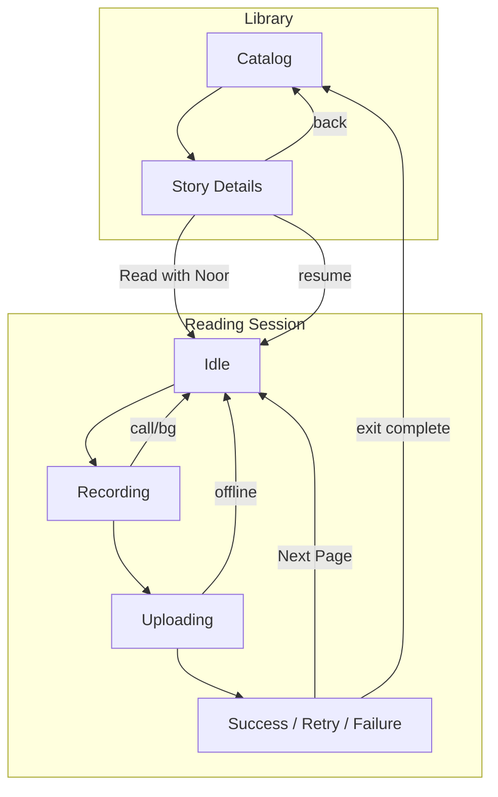

# Recovery Flows

**Version:** 1.0  
**Status:** Production-ready (MVP)  
**Audience:** Product, Flutter engineering, QA  
**Locale:** Child UI Arabic RTL · Documentation English  

---

# Document Purpose

Define **navigation and state recovery** when interruptions occur during **Read with Noor** or library entry. Aligns with `08_Edge_Cases.md`, `12_AI_Evaluation_Flow.md`, `Recording UX Specification.md`, `Book Library Flow.md`, and `Audio Playback Flow.md`.

**Principle:** Never blame the child; always land on a **known state** with one clear next action; preserve **Session Store** whenever safe.

---

# Session Store (Recovery Anchor)

Fields persisted locally (`13_System_Flow.md`, `EC-06`):

| Field | Recovery use |
|-------|----------------|
| `clientSessionId` | Correlate analytics after resume |
| `storyId` | Match resume to story |
| `currentPageIndex` | Reopen correct page **Idle** |
| `completedPageIds[]` | Progress / Summary |
| `continuedWithoutSuccessPageIds[]` | Decision 7 tracking |
| `pageRetryCounts{pageId}` | Offer **Continue** |
| `attemptSequence{pageId}` | Upload dedupe |
| `sessionStartedAt` | TTL policies (host) |

**TTL recommendation:** 72h idle; after TTL, treat as new session from Story Details.

---

# Recovery Matrix (Quick Reference)

| Interruption ID | During states | Immediate action | Landing state | Navigation |
|---------------|---------------|------------------|---------------|------------|
| RF-OFFLINE | Uploading, Processing | Cancel/fail request | **Idle** + `network.01` | Stay on page |
| RF-RETRY-UP | Uploading, Processing | User taps **Start Reading** when online | **Uploading** (new attempt) | Stay |
| RF-CALL | Recording, Playback | Pause/stop capture or audio | **Idle** or resume Recording per OS | Stay |
| RF-BG | Any | Pause narrator; suspend recording per OS | Resume or **Idle** | Return to app |
| RF-PERM | Recording, Preparing | Stop capture | **Idle** + `mic.*` | Stay |
| RF-KILL | Any | Persist store on last safe checkpoint | Resume modal on Details | Details → session |
| RF-STORAGE | Stopped, Uploading | Abort write/upload | **Idle** + storage message | Stay / parent help |

---

# RF-OFFLINE — No Internet / Connection Lost

## Scenarios

- **EC-01:** Offline before or during **Uploading**.
- **EC-02:** Connection drops mid-request (**Processing**).

## Expected Behavior

1. Map to `failureCode` **`NETWORK_ERROR`** (`12`).
2. Show `network.01` (and `network.02` if repeated).
3. Cancel in-flight HTTP if still running.
4. Transition UI to **Failure** overlay → **Idle** on current page.
5. **Do not** increment **Retry** outcome count.
6. **Do not** auto-retry upload when connectivity returns (`EC-08` pattern for timeouts applies to manual retry only).
7. Preserve Session Store including partial attempt metadata.

## Navigation Recovery Path

```
Uploading/Processing ──network fail──► Idle (same page)
       ▲                                    │
       └──── child taps Start Reading ────────┘
              (when online)
```

## Child Messaging

- Arabic only: `network.01`, `network.02`.
- Optional subtle offline icon in reader chrome while offline.

## Acceptance Criteria

- **AC-REC-OFF-01:** Given upload in flight, when airplane mode on, then **Idle** within 60s client timeout with `network.01`.
- **AC-REC-OFF-02:** Given returned online, when child taps **Start Reading**, then new upload starts (new `attemptSequence`).

## Edge Cases

- Flapping network: debounce failure UI 2s to avoid flicker.
- Offline cached story: reading UI works; evaluation still requires network.

---

# RF-RETRY-UP — Retry Uploads (Manual)

## Purpose

After **Failure** from network/server errors, child (or parent-assisted) explicitly starts a new attempt.

## Rules

- **No automatic re-upload** after `AI_TIMEOUT` or `NETWORK_ERROR` (`EC-08`, `AC-03-02`).
- Child must complete **Recording** again (**Start Reading** → read → **Done**) unless product later adds «إعادة إرسال» — **not MVP**.
- Debounce: one upload at a time (`EC-07`).

## Navigation

Always remain on current page index unless host forces exit.

## Acceptance Criteria

- **AC-REC-UPL-01:** After `AI_TIMEOUT`, **Done** does not appear without new **Recording**.

---

# RF-CALL — Phone Call / Cellular Interruption

## During Recording

| OS behavior | App behavior |
|-------------|--------------|
| Recording interrupted | Stop capture; finalize partial if OS allows |
| Call ends | Return to **Idle** with `before.01` or host «انقطع التسجيل» — **do not** auto-upload partial unless >1s and product confirms — **MVP: discard partial, Idle** |

## During Playback (Narrator)

- Pause narrator immediately.
- On call end: remain paused; show tap-to-continue if control exists; else replay from start if child taps **Retry** path again — **MVP: resume if >50% played, else restart narrator** (implementation choice documented in `Audio Playback Flow.md`).

## Navigation

- Stay in Reading Session on same page.

## Acceptance Criteria

- **AC-REC-CALL-01:** Incoming call during Recording does not leave mic open after call.

---

# RF-BG — App Backgrounding / Foregrounding

## Recording

- Follow OS background audio policy; typically **recording stops** when backgrounded >N seconds.
- On foreground: **Idle** with optional `before.02`; Session Store intact.

## Uploading / Processing

- **EC-06:** Cancel request on background if host policy requires; on foreground **Idle** + `network.02` if incomplete.
- Alternative host policy: continue upload in background task — if continued, restore **Processing** UI on foreground.

## Playback

- Pause narrator on background; resume on foreground (`Audio Playback Flow.md`).

## Navigation

- Back stack unchanged.
- If OS kills app → **RF-KILL**.

## Acceptance Criteria

- **AC-REC-BG-01:** Background during upload does not duplicate `page_upload_completed` events.

---

# RF-PERM — Permission Revoked Mid-Session

## Scenario

Mic granted at start; user revokes in Settings during **Recording** or later.

## Behavior

1. Stop active recording immediately.
2. Discard unsafe partial capture.
3. Show `mic.01` / `mic.02`.
4. Land **Idle**.
5. Next **Start Reading** re-enters **Permission Request**.

## Navigation

- If permanent deny: host deep link to Settings (parent gate recommended).

## Acceptance Criteria

- **AC-REC-PERM-01:** Revoke during Recording → **Idle** within 1s of foreground with mic message.

---

# RF-KILL — App Kill / Crash / Force Stop

## Checkpoints

Persist Session Store on:

- Page transition (**Next Page**)
- **Success** / **Continue** acceptance
- Enter **Idle** after outcome
- **EC-06** exit hook

## On Relaunch

1. Host opens Catalog or last route.
2. If incomplete Session Store for `storyId`: Story Details shows **Resume** («متابعة من الصفحة {n+1}»).
3. Resume opens **Idle** at saved `currentPageIndex` — **does not** replay narrator unless child earns new **Retry** outcome.
4. Corrupt store: discard segment; log `session_store_corrupt`.

## Navigation Path

```
App kill ──► Relaunch ──► Story Details (resume CTA) ──► Reading Session Idle @ saved page
```

## Acceptance Criteria

- **AC-REC-KILL-01:** Kill during **Idle** page 3 → resume page 3.
- **AC-REC-KILL-02:** Kill during **Uploading** → resume **Idle** page n; no ghost upload.

---

# RF-STORAGE — Low Device Storage

## Scenarios

- Cannot write temp audio in **Stopped**.
- Cannot cache narrator asset on Details prefetch.

## Behavior

- **Stopped / Recording finalize fail:** **Idle** + parent-facing hint (host) «مساحة التخزين منخفضة»; child sees simplified `retry.01` + icon.
- Block new **Recording** until ≥10MB free (threshold — engineering configurable).
- Do not delete Session Store.

## Navigation

- Stay on page; optional link to host storage settings (parent gate).

## Acceptance Criteria

- **AC-REC-STOR-01:** Simulate full disk → **Start Reading** blocked with Arabic message.

---

# RF-EXIT — Child Leaves Reading Session (Host Back)

## Behavior

- Confirm dialog only if **Recording** or **Uploading** active (host UX); MVP Reading Buddy recommends: silent cancel upload + save store on **Idle** only exits without modal.
- Analytics: `reading_session_exited` with last state enum.

## Navigation

- Default: Story Details for same `storyId`.
- **Reading Summary** complete: Catalog via `cta.read_another_story`.

---

# RF-NAV — Navigation Recovery Paths (Consolidated)



---

# Duplicate Actions & Storm Protection

| Pattern | Mitigation |
|---------|------------|
| Double **Done** | Debounce 500ms (`EC-07`) |
| Tap **Start Reading** while uploading | Disabled |
| Rapid offline/online | Hold failure banner min 3s |
| 40 evaluates/session (`EA-08`) | Block upload; show host «لنكمل لاحقًا» |

---

# QA Scenarios (Recovery)

1. Airplane mode at upload → message → online → new recording works.
2. Incoming call during record → Idle → new attempt.
3. Background 30s during narrator → pause → foreground resume.
4. Revoke mic → Idle → re-grant → record works.
5. Force stop at page 5 → relaunch resume page 5 **Idle**, no narrator autoplay.
6. Storage full → block record with clear message.

---

# Related Documents

| Topic | Document |
|-------|----------|
| Edge case IDs | `08_Edge_Cases.md` |
| Failure codes | `12_AI_Evaluation_Flow.md` |
| Recording UX | `Recording UX Specification.md` |
| Audio interrupts | `Audio Playback Flow.md` |

---

# Revision History

| Version | Date | Notes |
|---------|------|-------|
| 1.0 | 2026-07-27 | Initial recovery navigation spec |
